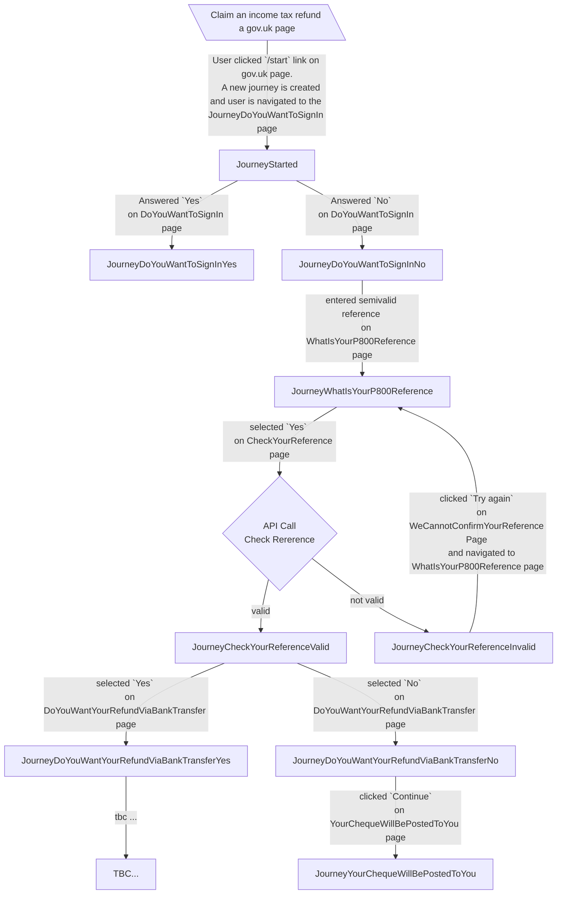

# :construction: p800-refunds-frontend

This service allows taxpayers to request refunds for overpaid tax.

The application is currently being developed.


# Project setup in intellij


## Project specific sbt commands

### Turn off strict building

In sbt command in intellij:
```
sbt> relax
```
This will turn off strict building for this sbt session.
When you restart it or you build on jenkins, this will be turned on.

### Run with test only endpoints

```
sbt> runTestOnly
```


## Application architecture

### Journey States
Journey states correspond to the result of the submission on pages (or endpoints).




### License

This code is open source software licensed under the [Apache 2.0 License]("http://www.apache.org/licenses/LICENSE-2.0.html").
