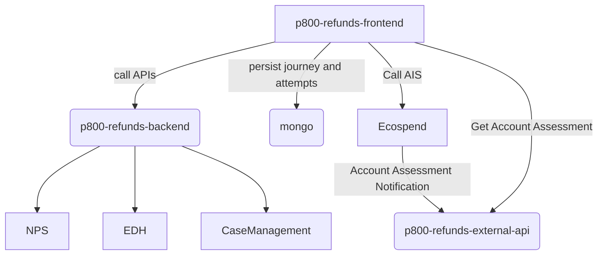

# P800 Refunds Frontend

## Overview
This service facilitates refund requests for taxpayers who have overpaid their taxes, 
enabling them to claim refunds without logging in. 
For a logged-in experience to claim refunds, please visit the [Repayments Frontend project](https://github.com/hmrc/repayments-frontend).

Users have the option to receive their refunds either through a bank transfer or by cheque. 
The system supports two distinct processes based on the chosen method:

- **Cheque Journey:** Users can opt to receive their refund via a traditional cheque.
- **Bank Transfer Journey:** Users can choose to have their refund deposited directly into their bank account.

To ensure security, users are required to verify their identity by providing specific details. 
The required information varies slightly depending on whether the cheque or bank transfer journey is selected.

## Cheque Journey
The cheque journey is a simplified process requiring the provision of a National Insurance Number (NINO) 
and a P800 Reference Number, as detailed in the correspondence from HMRC. 
If the data matches the records, confirmation will be obtained that the cheque will be mailed to the recorded address.


## Bank Transfer Journey
The bank transfer journey is a more sophisticated process. The user provides their NINO, P800 Reference number, 
and date of birth. After successful validation, the user can select a bank from the list of available 
banks and authenticate their bank account.

The integration with the Banks API is facilitated through Ecospend's AIS (Account Information Services) APIs. 
Once the application receives the necessary information about the user's bank accounts, 
it will use this data to verify the bank account and transfer the funds accordingly.

## IP Address Lockouts

In accordance with security requirements, this application tracks and blocks IP addresses. 

These are monitored to count the number of attempts made during each journey, 
especially when incorrect data (e.g., NINO, P800 Reference Number) is entered. 
Only a limited number of attempts are allowed per IP address. 
After reaching the maximum number of allowed attempts, the IP address will be locked out for 24 hours. 
This lockout will trigger a specific notification page and restrict access to the service.


## Account Assessment by Ecospend
In line with security requirements, this application must verify the bank accounts used for withdrawing funds. 

The Ecospend Gateway can assess an account using tenant-specific custom algorithms to deliver a clear FAIL/PASS outcome.
These assessments are computed asynchronously and the results are received as notifications. 
Specifically, Ecospend calls an external API and sends a notification to the p800-refunds-external-api microservice, 
detailing the outcome of the bank account verification. 
This microservice actively polls p800-refunds-external-api until it receives this notification. 
For more information, visit [p800-refunds-external-api](https://github.com/hmrc/p800-refunds-external-api/).


## Name Matching
In accordance with security requirements, the taxpayer's name received from the 
NPS system must match one of the names on the bank account. 

This requirement is challenging due to the differences in how data are stored across these systems. 
To address this, a fuzzy name matching heuristic is implemented, which accommodates mismatches. 
This algorithm involves various string transformations and comparisons, 
including the calculation of Levenshtein distance. For more details, see `NameMatchingService` and 
the corresponding specification.

## Risk Assessment
In accordance with security requirements, additional checks are performed using the EDH risk check API. 

This process determines one of two outcomes: "Pay" or "DoNotPay," which then directs subsequent actions.

- **Pay Outcome**: If the risk assessment is successful, the BACS Repayment API is activated to transfer the refund funds to the selected bank account.
- **DoNotPay Outcome**: If the risk assessment fails, the refund is suspended at originated system (NPS), and the case is escalated to the Case Management System. This prompts an HMRC representative to contact the individual regarding the refund.

# Architecture
This service is part of the P800-refunds microservice suite, which includes:

- [P800-refunds-backend](https://github.com/hmrc/p800-refunds-backend)
- [P800-refunds-external-api](https://github.com/hmrc/p800-refunds-external-api)
- [P800-refunds-stubs](https://github.com/hmrc/p800-refunds-stubs)



# Running the Service

To start the service, use the following commands:
- `sbt run` to launch the service normally.
- `sbt runTestOnly` for testing modes.

After starting the service, access the helper page at:
[`http://localhost:10150/get-an-income-tax-refund/test-only`](http://localhost:10150/get-an-income-tax-refund/test-only)

This helper page enables you to initiate a journey, inspect associated journey data, and simulate receiving notifications from Ecospend.

Ensure that all dependent applications, including MongoDB and other microservices managed by `P800_REFUNDS_ALL`, are also running. 
To start these dependent services, use the Service Manager command:

```bash
sm --start P800_REFUNDS_ALL
```

## Test Data

For testing purposes, refer to the [p800-refunds-stubs](https://github.com/hmrc/p800-refunds-stubs) repository. 
This contains detailed documentation and a list of scenarios you can use. 
Make sure to use the appropriate National Insurance Number (NINO) corresponding to the scenario you choose.


## NPS Integration
This service interfaces with the NPS through a data exchange layer (HIP and/or IF). As the master data system for refunds, 
NPS provides essential APIs that support various functionalities of this project:
- **Verification of P800 Reference Numbers**
- **Retrieval of User Data** through TraceIndividualAPI
- **Processing Payments** by issuing Bacs Repayments for bank transfers and Payable Orders for cheques
- **Suspension of Refunds** as needed

## EDH Integration
This system integrates with the Enterprise Data Hub (EDH) through the p800-refunds-backend microservice. 
EDH offers an API specifically for performing risk assessments, which are critical in determining the outcome of refund processes.

## Case Management Integration
Integration with the Case Management system is also managed through the p800-refunds-backend microservice. 
This system provides an API used to open cases when a risk assessment fails, facilitating necessary follow-ups and resolution actions.

## Ecospend Integration
This service integrates with Ecospend, a third-party system that implements Open Banking APIs. 

These APIs enable the system to:
- List available banks
- Obtain user consent for data sharing
- Validate bank account details
- Retrieve account information, such as sort code, account number, and owner's legal names, crucial for name matching

For more detailed guidance on using these APIs, refer to the [Ecospend documentation](https://docs.ecospend.com/new/guides.html#aisIntro).

The API is accessed via squid proxy.

## Data Storage

This system utilizes MongoDB to store data specific to each user journey. 
The retention period for journey-related data is set at 30 minutes, reflecting the brief duration required for processing.

Additionally, the system records IP addresses and the number of failed attempts associated with these addresses, 
retaining this information for 24 hours to enhance security measures.

In accordance with security requirements, all personally identifiable information (PII), such as addresses, names, 
identifiers, and IP addresses, is encrypted before being stored in MongoDB. 

# Java version
This project builds on JDK v11. 
In particular, this version of java is used when building this service: `OPENJDK_VERSION_11_0_23_0_9`

# Project Setup in IntelliJ

When importing a project into IntelliJ IDEA, it is recommended to configure your setup as follows to optimize the development process:

1. **SBT Shell Integration**: Utilize the sbt shell for project reloads and builds. This integration automates project discovery and reduces issues when running individual tests from the IDE.

2. **Enable Debugging**: Ensure that the "Enable debugging" option is selected. This allows you to set breakpoints and use the debugger to troubleshoot and fine-tune your code.

3. **Library and SBT Sources**: For those working on SBT project definitions, make sure to include "library sources" and "sbt sources." These settings enhance code navigation and comprehension by providing access to the underlying SBT and library code.

Here is a visual guide to assist you in setting up:


## Project specific sbt commands

### Turn off strict building

In sbt command in intellij:
```
sbt> relax
```
This will turn off strict building for this sbt session.
When you restart it or you build on jenkins, this will be turned on.

### Run with test only endpoints

```
sbt> runTestOnly
```

## Application Architecture

The architecture of this application revolves around the `Journey` case class, 
which serves as the main model class. Understanding this class is crucial as it encapsulates the core functionality 
and data flow within the application.

### Architecture Pattern
The application adheres to the standard Model-View-Controller (MVC) pattern, structured as follows:
- **Controllers and Actions**, which call 
- **Services**, which call
    - **Connectors**: Facilitate communication with external systems or services.
    - **Database**: Interactions with the database to retrieve or update data.


### Journey Flow
- The process begins at the `/start` endpoint, which initializes a new journey instance.
- Subsequent pages retrieve the current state of the journey from the database as needed during request processing.
- If modifications are required, the journey data is updated in the database to ensure the state of the application is accurately maintained.

### Endpoint for Monitoring Journey Data
To view the current data of a specific journey during runtime, utilize the following endpoint:
```
GET /get-an-income-tax-refund/test-only/show-journey/:journeyId
```

This endpoint provides a live snapshot of the journey's data, aiding in debugging and development processes.


## Navigating through quickly with Tampermonkey
A script has been created to be used with [Tampermonkey](https://www.tampermonkey.net/) to enable fast navigation through
the service to make testing easier. To make use of it, install the Tampermonkey browser extension on your browser and
then install [this script](https://raw.githubusercontent.com/hmrc/p800-refunds-frontend/main/tampermonkey/quickJourney.js). After
installation, a green "Quick submit" button will be visible near the top-left of each page in the service. Clicking this
button will autocomplete the inputs on the page (including the test-only start page) and automatically click the continue
button on that page.

## Testing features requiring `True-Client-IP` header

Optionally, you can setup an Nginx server as a reverse proxy to test and debug with custom values for
`True-Client-IP`.

This can be useful for testing the lockout mechanism.

Install with brew and start the service:

```bash
brew install nginx
brew services start nginx
```

Edit the configuration under `/usr/local/etc/nginx/nginx.conf` to contain the following `server` block within the
`http` block.

```nginx
server {
    listen 127.0.0.1:8008;

    location / {
        proxy_set_header True-Client-IP 10.10.10.10;
        proxy_pass http://127.0.0.1:10150;
    }
}
```

The port used for the `listen` directive can be adjusted to any free port. The IP address given to the
`proxy_set_header` directive can be changed.

After making any changes make sure to run `brew services restart nginx`.

Now using the application normally via the new port, `localhost:8008` in this example, each request will send an
additional `True-Client-IP` header.


## Testing Approach for p800-refunds-frontend

Our approach to testing the microservice incorporates both unit tests, where we test individual components in isolation, and integration tests, which incorporate Selenium to test the behavior of the entire application. We find this method very effective and aligned with our needs.

We've achieved excellent test coverage metrics—86.15% for statements and 62.73% for branches. Additionally, our Business-Driven Development (BDD) approach ensures thorough coverage of business functionality and acceptance criteria.

### Our Behavioural Tests Structure

- When a user is on page P1
- And performs action A (such as clicking a button),
- And the APIs return responses R,
- Then the new page P2 is rendered,
- Which displays specific content C.

This setup allows us to simulate real user interactions across the service, ensuring that the service behaves according to requirements. The implementation details are irrelevant as long as the outcomes align with business requirements.

We use Selenium for these tests because it can verify that actions like clicking a link, entering text, changing a radio button, selecting from a dropdown, or confirming that JavaScript refreshes a page can be executed. Unit tests cannot check if a browser can render and interact with components effectively; Selenium can.

This approach has enabled us to effectively catch bugs and define the intended behavior of the service, which is the main goal of testing.

### Living Documentation

As mentioned, our black-box testing also serves as living documentation. It clearly shows how the app behaves based on user actions and outcomes.

### Using Unit Tests

It's important to note that we also rely heavily on unit tests to examine many components individually, especially when testing numerous edge cases is too costly with a full application setup.

There are plenty of unit tests. However, there are more pages than components that require unit tests, therefore, the number of integration tests using Selenium is higher.

### Build Times - A Reason to Use Selenium Sparingly

It takes about 6 minutes on slow Jenkins agents to build the application and less than 2 minutes on an old laptop. These times are perfectly acceptable and comparable to the build times of other services, keeping our development cycle smooth and agile.

If build times start to get a lot longer, we should think about breaking this microservice into smaller pieces instead of cutting back on our integration tests.

### Coding Speed

We've found it much cheaper and quicker to write a single behavioral test that mimics a user interacting with our application than to test all components in isolation and mock up the behavior of dependent objects. This test covers multiple aspects of the application at once, reducing the redundancy and effort involved in setting up numerous isolated tests.

This approach also allows us to reduce maintenance headaches and easily adapt code to frequently changing business requirements.

### Code Maintenance and Cleanup

Maintaining a codebase where components are tested in isolation with mocked dependencies is tricky and time-consuming. When dependent objects change behavior, updating the corresponding mocks becomes error-prone and hinders refactoring. This contributes to lower coding speed and increases the complexity of maintaining code cleanliness.

### Comparison to UI Tests

Our BDD does not overlap with what and how UI tests (p800-refunds-ui-tests) are conducted. We test individual actions on pages and their outcomes before PR merges or during build time. UI tests examine entire user journeys after the microservice is built (and deployed?) and integrated with other applications.

## License

This code is open source software licensed under the [Apache 2.0 License]("http://www.apache.org/licenses/LICENSE-2.0.html").
