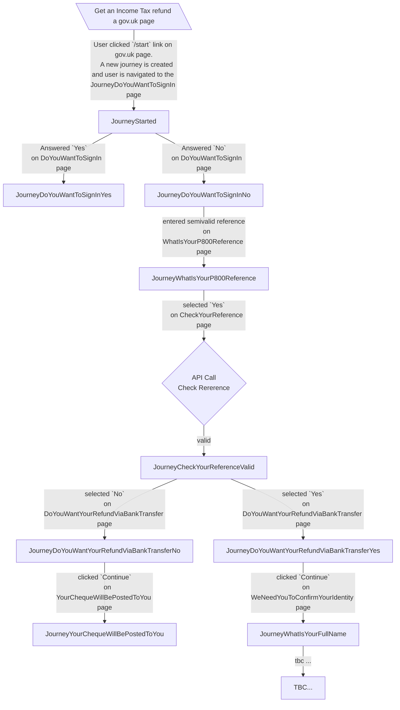

# :construction: p800-refunds-frontend

This service allows taxpayers to request refunds for overpaid tax.

The application is currently being developed.


# Project setup in intellij


## Project specific sbt commands

### Turn off strict building

In sbt command in intellij:
```
sbt> relax
```
This will turn off strict building for this sbt session.
When you restart it or you build on jenkins, this will be turned on.

### Run with test only endpoints

```
sbt> runTestOnly
```


## Application architecture

### Journey States
Journey states correspond to the result of the submission on pages (or endpoints).

[If mermaid dosen't render click here](https://mermaid.live/edit#pako:eNqtVU1z2jAQ_Ss7OoOLceIAh84k5JIeMpmEhknrzqDaC6i2JSrLIQnDf-_KNjblK-lMzcWs3nv7tNqVVyxUEbIBmyZqGc65NjC6DmQggZ6Zes7jBZ_h9yAYJlykwCUIGaoUwfAX0DjNZQTcAp08BgsNgh9Qsttt-JqhhjARYYwRTD5lhvQnkAgZg5LbLKekXILEJfxSuZb4CiKDUCM3xOWUJrdiFJP8WcyKqFFg5ghfSvy1elL5mEszUg9iJm9k6afy8nkDe7AmiAyw2ebOQu3-UmZL1Nb5rZpUYbJ9OA_sJdrD3aqdjAcQTXaUpkieYSqeeSIiW26KyBAbL-M5NzcZqei7XqdzXwMOOzqC3nF1FFUZyzDB0BZq8oTZVl2GcwxjS_vbRuPi0e6CDq5ev1yIIU-SVQkpGuDuBmwImlAhC_fE2N77emP6mGhTyKJ4e7XYd_tY4k7L1qpSmVK5VYaK7ty0ZmZbc4xDLgk2VHIqdLpfmYo51SqF5ZwWQBgaiop94mQr4mZOaKwMFoZogOUMo48fPBRjsHX4R8vyzuHXrVxx6V54FPyKy3ikucxI6_A0vs-jPDsN-nGPh-f2v1s8PtgnKZXd-n6kRjFC5jipLVs67fZ3jmORJFd4pzLa18iqH_Z6gvDPFqnwzRCZnyE4jtMkHF0N6T9rsRR1ykVEn5BijgNGV3KKARvQa8R1HLBArgnHc6MeXmXIBkbn2GL5ws7XteAzzdNNcMElG6zYCxu4Zz3Hu_Au3PNu33X7fu-8xV7ZoO12O47nd3q-73UvPK_bO1u32JtSJOE6Hc_td_we_Xy_TwqF4Ldi0eqv_wAOZFOL)



---

### Navigating through quickly with Tampermonkey
A script has been created to be used with [Tampermonkey](https://www.tampermonkey.net/) to enable fast navigation through
the service to make testing easier. To make use of it, install the Tampermonkey browser extension on your browser and
then install [this script](https://raw.githubusercontent.com/hmrc/p800-refunds-frontend/main/tampermonkey/quickJourney.js). After
installation, a green "Quick submit" button will be visible near the top-left of each page in the service. Clicking this
button will autocomplete the inputs on the page (including the test-only start page) and automatically click the continue
button on that page.

---

### Testing features requiring `True-Client-IP` header

Optionally, you can setup an Nginx server as a reverse proxy to test and debug with custom values for
`True-Client-IP`.

This can be useful for testing the lockout mechanism.

Install with brew and start the service:

```bash
brew install nginx
brew services start nginx
```

Edit the configuration under `/usr/local/etc/nginx/nginx.conf` to contain the following `server` block within the
`http` block.

```nginx
server {
    listen 127.0.0.1:8008;

    location / {
        proxy_set_header True-Client-IP 10.10.10.10;
        proxy_pass http://127.0.0.1:10150;
    }
}
```

The port used for the `listen` directive can be adjusted to any free port. The IP address given to the
`proxy_set_header` directive can be changed.

After making any changes make sure to run `brew services restart nginx`.

Now using the application normally via the new port, `localhost:8008` in this example, each request will send an
additional `True-Client-IP` header.

### License

This code is open source software licensed under the [Apache 2.0 License]("http://www.apache.org/licenses/LICENSE-2.0.html").
