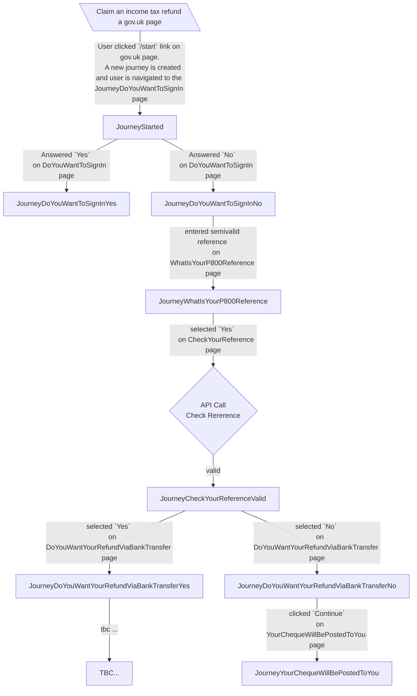

# :construction: p800-refunds-frontend

This service allows taxpayers to request refunds for overpaid tax.

The application is currently being developed.


# Project setup in intellij


## Project specific sbt commands

### Turn off strict building

In sbt command in intellij:
```
sbt> relax
```
This will turn off strict building for this sbt session.
When you restart it or you build on jenkins, this will be turned on.

### Run with test only endpoints

```
sbt> runTestOnly
```


## Application architecture

### Journey States
Journey states correspond to the result of the submission on pages (or endpoints).

[If mermaid dosen't render click here](https://mermaid.live/edit#pako:eNqtVU1v2kAQ_SujPYPLR4DYh0pALvQQoYQGpXUltmaBre1Zul6TkIj_3llDbL6hUnxAZva9N29nZ9bvLFBjwTw2idRLMOPawODORx-BnqlapOGcT8VP3-9GXMbAESQGKhZg-CtoMUlxDNwCnTQEC_X9X7Bml8vwPREagkgGoRjD6EtiSH8EkcQQFG6znDWlDShe4I9KNYolyAQCLbghLqc0qRWjGPKFnGZRo8DMBHxb4-_Us0qHHM1APcop9nDtZ-Pl6wfs0ZogMsDHNvcWcvdtTF6Ets6fRTLaxMn38URwkOkARzLX57xXn5HyXu1lPIIosgs0WfJExHLBIzm2R0wRDEThZTjjppeQiu7fVioPOeC4oxPoPVcnURtjiYhEYA6PojsTQWhpuzYKF092F9Qs-Xp7Lrs8it7XkKzp-j2wIShCmSw8EGN776sP06dEi0JmxTuoxaHbpzXuvGyuispcrdzDxbb2ZdwmRz6tA70EPuUSt8o9FF2O5KKrcCJ1vFv4fnH-dlx3xvRcz1zfMpANbfF7qawXmicfhQ2X7rInyTscw4HmmJDWcX-XeYeDfr3H43P_6RZPXwxnKftdQp1gJKZilFu2dNrt31QMZRR1RF8ltK-BVT_u9Qzhvy1S4YshNL8DcBynSDjodOk_K7FY6JjLMX32snvAZ_QZiYXPPHodcx36zMcV4Xhq1OMSA-YZnYoSS-d2Pu8kn2oeM2_Co4Sic47Me2evzCtX6xWn1mg0qrVmvV5ttGoltmRe7cZpuc1aza22XLd5W6-0ViX2phRJVB23Qmvubb3ZbLaq7s1NpvcjW7RJV_8A7wiPQg)




### License

This code is open source software licensed under the [Apache 2.0 License]("http://www.apache.org/licenses/LICENSE-2.0.html").
